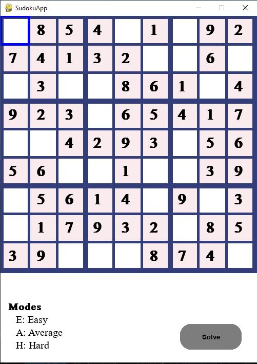
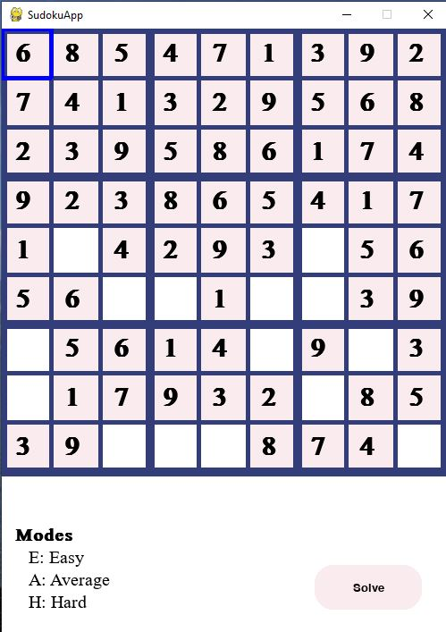
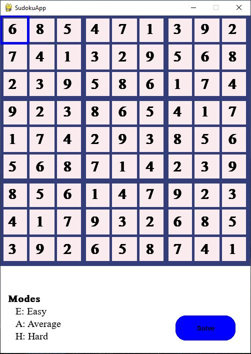

# Sudoku-Solver
 
Sudoku is an extremely popular logic and combinatorial math-based puzzle that millions attempt on a daily basis online and on paper. This project implements a Sudoku game in Python with an in-built automatic puzzle solver ( ***Backtracking algorithm*** to find and evaluate candidate solutions recursively ) to add some ***Artificial Intelligence***. This game will allow the users to enter the numbers into the grid interactively as per the rules.

### Modes : 
    * Easy 
    * Average
    * Hard
  
### Feature :
    - Creates easy,average and hard sudoku boards dynamically using the random module.
    - Sudoku can be solved either by the user or can be done automatically using Solve button.

### Requirements : 
    - Pygame Module (Pygame is a cross-platform set of Python modules which is used to create video games)
    - Pygame_widgets (A helper module for common widgets that may be required in developing applications with Pygame) 
    - Random (The random module is a built-in module to generate the pseudo-random variables)

### Working :
 
 

  

  

  

### Language : 
    Python 

### Algorithm :
    Backtracking Algorithm
